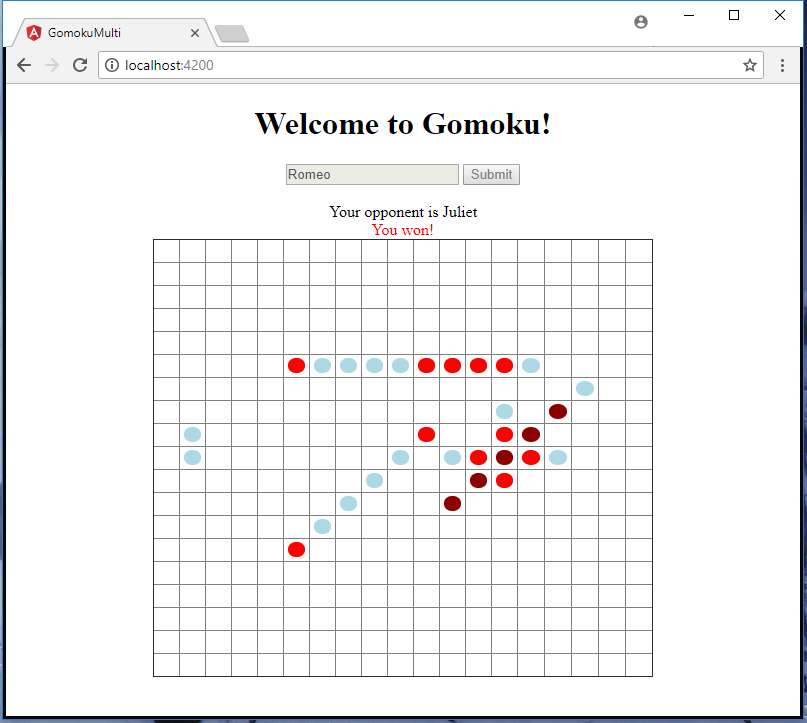
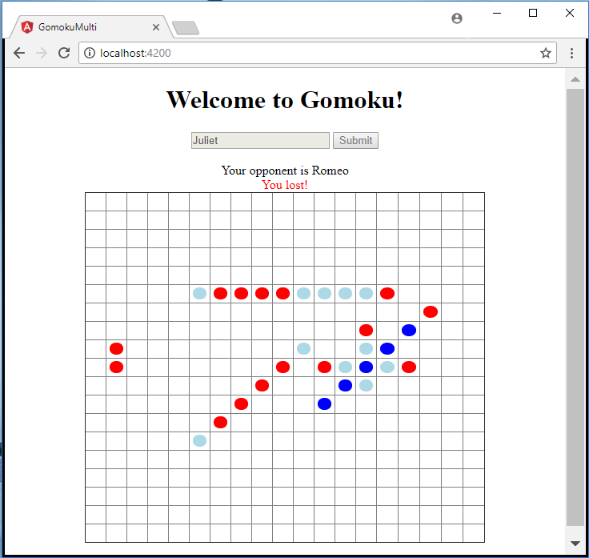

BACK-END:
1) Open "Gomoku/GomokuAPI.sln" with Visual Studio 2017
2) Open "Startup.cs" and replace "http://localhost:4200" with the domain and port where the Angular web server is running
3) Build and Start

FRONT-END:
1) Open "GomokuClient\src\app\userplay.service.ts" and replace "http://localhost:62411/api/game" with the URL where the C# service is running
2) Open "GomokuClient" in console
3) Run "npm install"
4) Run "ng serve --open" for dev environment

Open 2 or more separate client windows with a browser to simulate 2 or more players, the back-end will pair the players.

Each player takes turns against his opponent. The goal of the game is to occupy 5 consecutive squares in any direction. Squares that are occupied by the player are red. Squares occupied by the player opponent are blue.

For questions, contact me at luca.diminervino@gmail.com